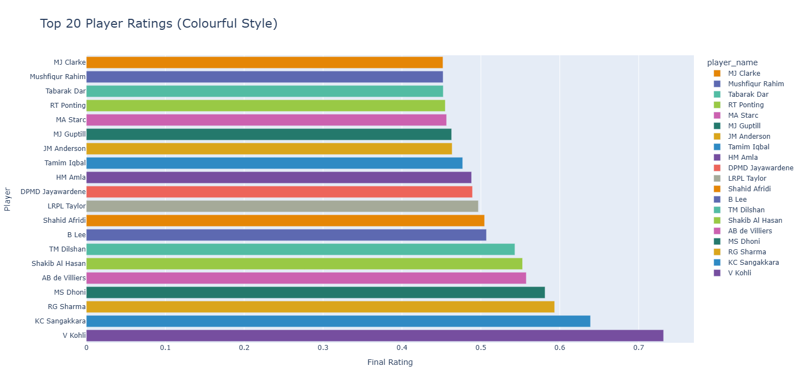
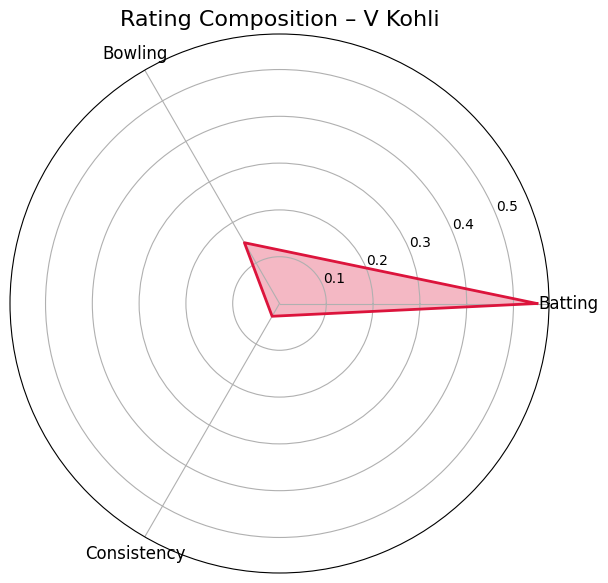
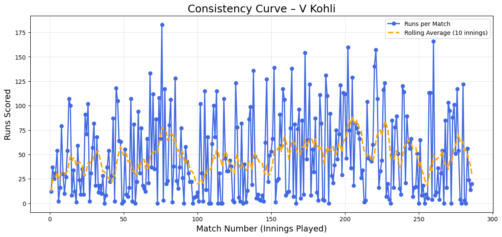

# Cricket Player Performance Rating and Prediction System

## Overview
This project implements a complete cricket player performance evaluation and prediction system using multiple datasets. It includes:

- Batting and bowling score computation  
- Player consistency measurement  
- Final weighted rating model  
- Minimum match penalty  
- Top 20 player visualizations  
- Radar charts for individual players  
- Machine learning models for runs, wickets and fantasy point predictions  

The system evaluates both batters and bowlers using a role-based weighting model.

---

## Project Structure

    project/
    │
    ├── batter_player_stats.csv
    ├── bowler_player_stats.csv
    ├── detailed_player_data.csv
    ├── match_summary.csv
    │
    ├── notebook.ipynb
    └── README.md

---

## Datasets Used

### 1. batter_player_stats.csv
Contains aggregated batting statistics for each player.

### 2. bowler_player_stats.csv
Contains aggregated bowling statistics for each player.

### 3. detailed_player_data.csv
Contains match-level performance for each player, including runs, balls faced, wickets, overs bowled, economy and fantasy points.

### 4. match_summary.csv
Contains match-level metadata including venue, match winner, overs and team details.

---

## Features

### Data Cleaning and Merging
- Unified player names  
- Combined batting and bowling stats into a single dataframe  
- Standardized missing values  
- Calculated total matches per player  

### Batting Score Formula

    0.65 * total_runs  
    0.20 * strike_rate  
    15   * player_of_match_awards  
    0.10 * (total_runs / matches)

### Bowling Score Formula

    8  * total_wickets  
    30 * (1 / economy_rate)  
    15 * player_of_match_awards  
    20 * (wickets_per_match)

### Consistency Score

    avg_runs / std_runs

Then normalized.  
Higher values indicate more stable run-scoring across innings.

### Final Rating Weights

For batters:

    0.55 * batting_score_norm
    0.15 * bowling_score_norm
    0.30 * consistency_score_norm

For bowlers:

    0.10 * batting_score_norm
    0.60 * bowling_score_norm
    0.30 * consistency_score_norm

A match penalty is applied if total matches < 40.

---
## Visualizations

### Top 20 Player Ratings (Plotly)
Add your exported chart here:

### Player Radar Chart
Shows weighted batting, bowling and consistency contributions.

### Consistency Curve
Match-by-match run progression illustrating consistency trends.

---

## Machine Learning Models

### Run Prediction Model
Features: balls faced, fours, sixes, strike rate  
Model: RandomForestRegressor

### Wicket Prediction Model
Features: overs bowled, balls bowled, economy  
Model: RandomForestRegressor

### Fantasy Prediction Model
Uses runs, wickets, boundaries, economy and strike rate  
Model: Ridge Regression

---

## Installation

Install dependencies:

    pip install pandas numpy scikit-learn matplotlib plotly

Run the notebook:

    jupyter notebook notebook.ipynb

---

## Output Files

Place your exported images inside an images folder:

    images/
        top20.png
        radar.png
        consistency_curve.png

---

## Notes
- Weights in the rating model can be adjusted based on project requirements.
- Consistency scoring can be extended with additional metrics such as 50s/100s frequency.
- Supports further extension into a dashboard (Plotly, Streamlit or Flask).
